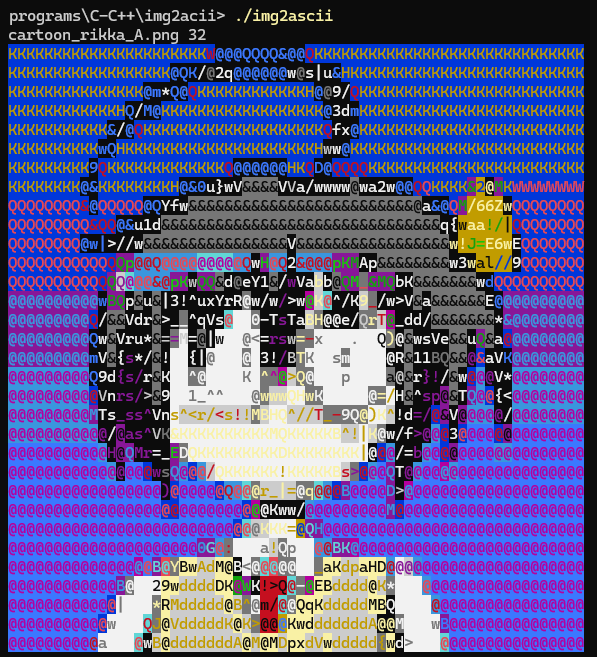

# image2colorCLI
tool to display images as coloured ascii art on the console

## Usage
run the program and write the file name and how many rows the output will have (columns are set automatically based on a character ratio of 9/19)
```bash
./img2ascii
img.png 32
```
<br>
alternatively write to a file and later read it with cat
```bash
.\img2ascii.exe | Out-File -Encoding ascii out.txt
img.png 32
cat out.txt
```
the programs is optimized to just use the necessary bytes to change color<br>
<br>
you can see an example of the results [1](result1.txt) and [2](result2.txt) running
```bash
cat result1.txt
cat result2.txt
```

## Building
character height/width, characters luminosity and colors are hard-coded<br>
to build download the source code, and change what you want<br>
the code uses [stb_image.h](https://github.com/nothings/stb/blob/master/stb_image.h) so you'll have to create a folder named stb_image and inside put [stb_image.h](https://github.com/nothings/stb/blob/master/stb_image.h)<br>
finally compile the code with gcc
```bash
gcc -s img2ascii.c -o img2ascii
```
